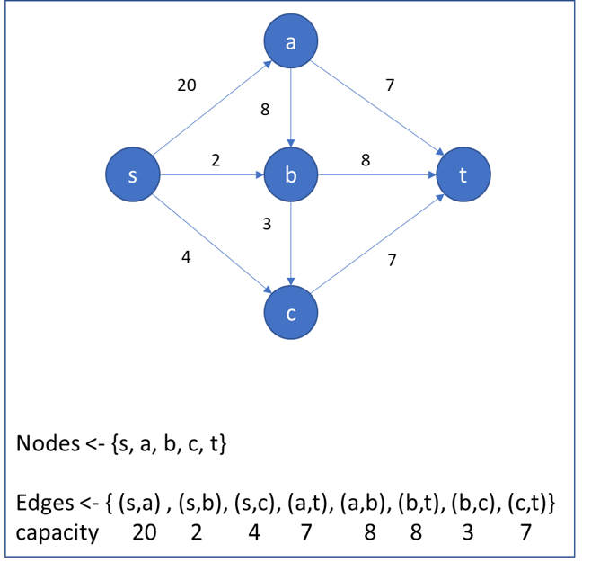
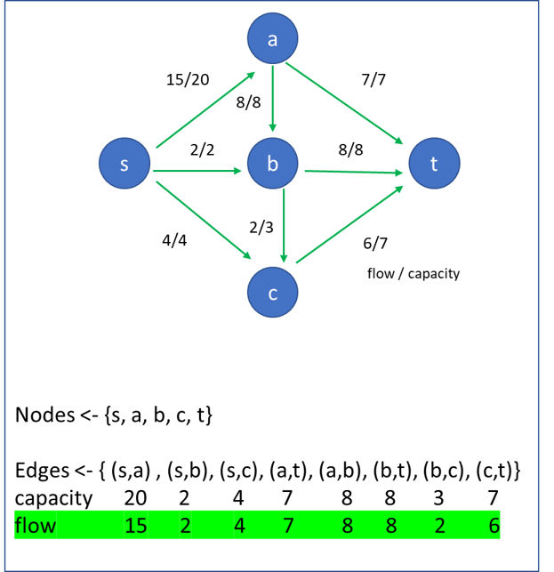
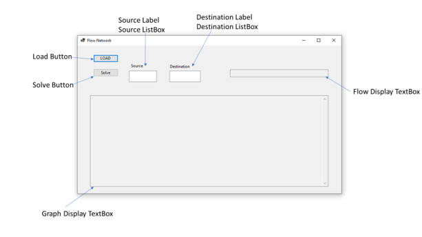

# Maximum Network Flow

Many problems can be modeled as the flow of some "thing" along defined pathways; the flow of items through a network.  Whether it is internet traffic (the flow of packets between routers) or the classic natural gas pipeline distribution problem, a special type of graph, a flow network, can be used to model certain network characteristics.  Determining the maximum flow the network can support is one of these characteristics.

A flow network is a graph that is a collection of a set of nodes and a set of directed edges which follow certain rules.  All flow begins in a designated source-node (_s_) end terminates in a designated sink-node (_t_). 

* Nodes
    * There will be at least 2 nodes, each of which is a string
    * One node will be the source ("s"), or origination point of every flow
    * One node will be the sink ("t"), or ultimate destination of every flow
    
* Edges 
    * Edges have a source node ("u") and a destination node ("v") often denoted "(u,v)"
    * The data stored on each edge has a non-negative integer property, Capacity, representing the maximum that can be assigned to this edge
    * There can be at most one edge between any two nodes
        * if edge (u,v) exists, then the edge (v,u) is not allowed
    * Edges have an integer Flow property representing the flow through the edge
        * 0 &le; Flow &le; Capacity 

In this homework we will build a program that analyzes flow networks to determine their maximum flow using the Edmonds-Karp algorithm.

**Example:**

A *flow* for the network is an assignment of integer Flows to each edge such that the following properties are satisfied:

- For each edge in the network, the Flow for that edge satisfies 0 &le; Flow &le; Capacity.
- For each node *u* other than *s* or *t*, the sum of the Flows on all incoming edges to *u* equals the sum of the Flows on outgoing edges from *u*. 

The value of the flow is the sum of the Flows on all outgoing edges from *s*, minus the sum of all of the Flows on incoming edges to *s*. The *maximum flow* is the greatest flow satisfying these constraints. It turns out that we can always find a maximum flow for which there is no flow on incoming edges to *s*; in fact, the algorithm we will use always finds such a maximum flow. We can therefore restrict our attention to such flows and simplify our definition of a maximum flow to the sum of the Flows on all outgoing edges from *s*.

The flow on the above network is 21, which is the maximum.

## Residual Capacity Graphs

The Edmonds-Karp algorithm uses a graph known as the *residual capacity graph* for the flow network. (**Note:** The video also refers to this graph as the residual capacity matrix, which is another format for representing the information in this graph.) The residual capacity graph contains the same nodes as the flow network and all of the edges. In addition, for each edge (u, v) in the flow network, the residual capacity graph also contains an edge in the opposite direction: edge (v, u). The data on each edge of the residual capacity graph contains a ResidualCapacity property. For each edge (u, v) in the flow network:

- The ResidualCapacity of edge (u, v) in the residual capacity graph is the Capacity of (u, v) minus the Flow on (u, v).
- The ResidualCapacity of edge (v, u) in the residual capacity graph is the Flow on (u, v).

Thus, the ResidualCapacities of (u, v) and (v, u) together represent the amount by which the current Flow on (u, v) can be legally changed. For example, consider edge (s, a) in the above example. In the residual capacity graph, edge (s, a) will have a ResidualCapacity of 20 - 15 = 5, which is the amount of additional flow that can be pushed along (s, a) without violating the constraints on that edge (i.e., ignoring the other constraints on the network flow). The ResidualCapacity of edge (a, s) will be 15, which is the amount by which the flow on (s, a) can be *reduced* without violating the constraints on (a, s).

The purpose of the residual capacity graph is to find paths in the flow network along which flow can be increased. For example, consider the following flow network with given flows, followed by the associated residual capacity graph (for readability, edges with 0 ResidualCapacity are not shown in the residual capacity graph):

In the flow network, every path from s to t contains at least one edge whose Flow matches its Capacity; hence, within this network, there is no path along which we can increase the flow. In the residual capacity graph, however, there is a path s -\> a -\> d -\> c -\> b -\> t in which each edge contains a positive ResidualCapacity. The minimum ResidualCapacity along this path is 2 (edge (a, d)); hence, we can increase the flow along this path by 2. Note that because edge (d, c) in the residual capacity graph is oriented in the opposite direction of edge (c, d) in the flow network, the flow along (c, d) is *decreased* by 2 (essentially, this flow is diverted to c -\> b -\> t to make room for additional flow into node d).

## Combining the Graphs

Because the residual capacity graph consists of exactly the same nodes and a superset of the edges of the flow network, we can simplify the representation by combining the two graphs into a single graph consisting of nodes and edges from the residual capacity graph. This graph contains edges that are not in the flow network. We will set the Capacity properties of each of these edges to 0 to indicate that they should be ignored. Likewise, any edge with a ResidualCapacity of 0 will be ignored by the maximum flow algorithm. We will therefore treat edges with a Capacity of 0 as being nonexistent in the flow network, and edges with a ResidualCapacity of 0 as being nonexistent in the residual capacity graph. 

## Finding the Maximum Flow

We will represent our flow network as graph with a set of nodes (N) and edges (E), G = (N, E).

**Note:** What follows is a somewhat more streamlined presentation of the algorithm than what is shown in the video, though the processing is essentially the same. You should refer to this presentation when writing your code.

Once the flow network (with all Flows set to 0) and the associated residual capacity graph are initialized the algorithm repeatedly performs a breadth first search to find a path from s to t in the residual network. As long as such a path is found:

1.  Find the minimum ResidualCapacity of the edges in the path; this represents an incremental flow which can be added to the network
1.  Update the Flow and ResidualCapacity properties along this path to reflect this additional flow (see below)

When no path s~>t can be found, the flows in the graph (G) represent a maximum flow from s to t. Note again that the breadth first search in the above algorithm ignores all edges whose ResidualCapacity is 0. In the next section, we will describe step 2 of the above loop in more detail.

### Updating the Flows and the ResidualCapacities

Recall that a breadth first search (see Lab Assignment 34) returns a dictionary whose keys are nodes. The value associated with each node other than s is its predecessor along a shortest path from s to that node, and the value associated with s is s itself. As in Lab Assignments 33 and 34, we will need to process the path from s to t backwards - from t to s. As we work our way from t to s, we make use of edges in both directions along this path. In what follows, we will refer to the edges going from s to t as *path edges* and the edges going in the opposite direction as *back edges*.

For each path edge and its associated back edge, we need to adjust ResidualCapacities to account for the flow being added. Because the flow will be added in the direction of the path edge, we need to *decrease* the ResidualCapacity of each path edge by the amount of the additional flow. On the other hand, we need to *increase* the ResidualCapacity of each back edge by this same amount.

To add the flow, we first need to determine which of each pair of edges is in the flow network. Specifically, if the path edge has a Capacity of 0, then the back edge is in the flow network. In this case, we need to *decrease* the Flow on the back edge by the amount of the additional flow. Otherwise, the path edge is in the flow network. In this case, we need to *increase* the Flow on the path edge by this amount.

## Graph Data Files
We will be loading graphs from files.  As in your labs, these files contain lists of edges, one per line.  The format of a line is "source node, destination node, edge capacity".  A few graph files can be found in the repository's Data folder.  

## Software Architecture

The software architecture is shown in the following class diagram:

The **UserInterface** class implements the GUI (see below). The **NetworkGraph** class implements the graph combining the flow network and the residual capacity graph. The **EdgeData** class stores the data on each edge. Each of these is described in detail in the coding requirements that follow.

## Coding Requirements

### The EdgeData Class

The **EdgeData** class needs a single **private** field, an **int** to store the flow placed on an edge. It also needs the following **public** properties:

- **Capacity**: Gets an **int** giving the capacity of an edge. It should *not* have a **set** accessor.
- **Flow**: Gets or sets an **int** giving the flow placed on an edge. Its **get** accessor should return the value stored in the **private** field. Its **set** accessor should do some error checking before assigning the given value to the private field. Specifically, if the given value is less than 0 or greater than the **Capacity**, it should throw an **ArgumentException** and leave the field unchanged.
- **ResidualCapacity**: Gets or sets an **int** giving the residual capacity for an edge.

It should also have a **public** constructor and a **public** method. These are described in what follows.

#### A public constructor

The constructor should take as its only parameter an **int** giving the initial value for both the **Capacity** and **ResidualCapacity** properties (the flow will initially be 0, which means that the **Capacity** and the **ResidualCapacity** should be the same). It should check that the given parameter is nonnegative - if it is negative, it should throw an **ArgumentException**.

#### A public ToString method

This method should override the **ToString** method. It should return a string of the form

flow: *x*; capacity: *y*; residual capacity: *z*

where:

- *x* is the value of the **Flow** property
- *y* is the value of the **Capacity** property
- *z* is the value of the **ResidualCapacity** property

This method will be helpful in debugging your code, as it will cause the value of an **EdgeData** object to be shown in the above format.

### The NetworkGraph Class

A **NetworkGraph** contains a single **private** field, a **DirectedGraph\<string, EdgeData\>**. (The DLL containing the **Ksu.Cis300.Graphs** project is provided in the starter solution.) It also contains the following **public** property:

- **Nodes**: Gets an **IEnumerable\<string\>** enumerating the nodes of the network. It should return the **Nodes** property of the underlying graph.

The **NetworkGraph** class also contains 5 **public** methods and a **public** constructor. These are each described in what follows.

#### A public constructor

The constructor should take as its only parameter an array of strings, each in the same form as a line of an input file"source-label, destination-label, capacity"; thus, each string describes an edge of the flow network.  It will process each string, adding the edge and its reverse edge to the graph. The graph built should be a combination of the flow network and the residual capacity graph; thus, the capacity of each reverse edge should be 0. **Note:** edges and nodes may only be added during instantiation.

#### A public GetOutgoingEdges method

This method should take a string giving node as its only parameter and should return an **IEnumerable\<Edge\<string, EdgeData\>\>** enumerating the edges coming from that node.

#### A public ZeroEdgeData method

This method should take no parameters and return nothing. For each edge in the graph, it should set the **Flow** to 0 and the **ResidualCapacity** to the **Capacity**.

#### A public **FindMaxFlow** method

This method should take as its parameters two strings giving the source and sink nodes.  It should return nothing. It must follow the "Finding the Maximum Flow" algorithm above. This method determines and assigns the **Flow** and **ResidualCapacity** property values for all the graph's edges. You should assume that these two properties have been initialized appropriately to some legal flow. Do *not* zero out the flow - instead, find the flow that results from applying the algorithm to this initial flow. This will allow one of the unit tests to test one aspect of the algorithm's behavior.

#### A public FlowFrom method

This method should take as its only parameter a string giving a node. It should return an **int** giving the total flow coming from that node.

#### A public GraphDisplay method

This method should take no parameters and should return a string describing the edges of the graph. The string should contain a description of each edge, with successive descriptions separated by `\r\n`. The description of each edge should be of the form "*source-node* -\> *destination-node* : *flow* / *capacity*". Build the string using a **StringBuilder**. After converting the **StringBuilder** to a string, use the string's **Trim** method to remove any white space from the ends of the string.

#### Private Methods

The class must contain least 2 **private** methods of your choosing.  No method, **public** or **private**, may be more than 30 lines (method signature to closing brace, using the formatting specified in the [style requirements](https://cis300.cs.ksu.edu/appendix/style/formatting/index.html)).

### The UserInterface Class

The User Interface is described below. Building it is a student task.  It should look similar to the image below.

### Controls

* "Load" button -- used to select a file from which to load a graph, see below.
* "Graph Display" **TextBox** -- used to display the edges of the graph.  It should be read-only, multi-line and have vertical and horizontal scroll bars.
* "Source" **ListBox** -- used to select the source node. Ensure **SelectionMode** is **One**. You will use its **SelectedItem** and **Items** properties and **SetSelected** method in your code - see https://learn.microsoft.com/en-us/dotnet/api/system.windows.forms.listbox?view=windowsdesktop-7.0&viewFallbackFrom=net-6.0
* "Destination" **ListBox** -- used to select  the sink node. Ensure **SelectionMode** is **One**. You will use its **SelectedItem** and **Items** properties and **SetSelected** method in your code - see https://learn.microsoft.com/en-us/dotnet/api/system.windows.forms.listbox?view=windowsdesktop-7.0&viewFallbackFrom=net-6.0
* "Solve" button -- takes the nodes selected in the above **ListBox**es and finds the max flow from source to destination
* "FlowResults" **TextBox** -- used to display the max flow from source-to-sink once it is calculated, see below.  It should be read only, multi-line and have vertical and horizontal scroll bars
* Two labels, one for each **ListBox**
* An **OpenFileDialog**

### Private Field

* A **NetworkGraph?** -- containing the graph for which  the maximum flow will be found. It should initially be **null**.

### Private Methods

You may have as many private methods as you deem necessary to provide the behavior described below.  No method, public or private may be more than 30 lines (method signature to closing brace, using the formatting specified in the [style requirements](https://cis300.cs.ksu.edu/appendix/style/formatting/index.html)).

### Program Behavior

* At start-up the **ListBoxe**s and **TextBox**es should be empty
* Clicking "Load Button" should
    * Prompt a user to select a graph file (the **OpenFileDialog**)
    * If the user selects a file:
      * Read the file and use its data to instantiate the **private NetworkGraph?**. If an exception is thrown while attempting to read the file, display the entire exception in a **MessageBox** and leave the **NetworkGraph?** and all GUI controls unchanged. If the file results in a graph with fewer than 2 nodes, throw (and display) an **IOException** containing the message, "The network has fewer than 2 nodes." You can construct an **IOException** containing a specific message by passing the message as the only parameter to the constructor.
      * Populate both **ListBox**es with their own lists of nodes. Each of these lists should be sorted (use a **List\<string\>**'s [**Sort**](https://learn.microsoft.com/en-us/dotnet/api/system.collections.generic.list-1.sort?view=net-6.0#system-collections-generic-list-1-sort) method). If the "Source" **ListBox** contains a node "s" (see the [**IndexOf**](https://learn.microsoft.com/en-us/dotnet/api/system.collections.generic.list-1.indexof?view=net-6.0#system-collections-generic-list-1-indexof(-0)) method of a **List\<string\>**), make this item selected in the **ListBox**. If the "Destination" **ListBox** contains a node "t", make this item selected in the **ListBox**.
      * Populate the "Graph Display" **TextBox** with a string representation of the graph, obtained from the appropriate method of the **NetworkGraph?**.  This representation should consist of one edge per line, each having the form "*source-node* -> *destination-node* : *flow* / *capacity*". Each edge's flow should be 0 at this point.
* Clicking "Solve Button" should do nothing if a graph hasn't been loaded. Otherwise:
    * Open a **MessageBox** prompting user to select Source and Destination in the list boxes if either's **SelectedItem** is **null**. Then exit the method.
    * Use the selections in the **ListBox**es to find a maximum flow using the appropriate method of the **NetworkGraph?**; update the "Graph Display" **TextBox** with a string representation of the graph with the maximum flow assigned to the edges.
    * Use the selections in the **ListBox**es to find the value of the maximum flow using the appropriate method of the **NetworkGraph?**, and update the "Flow Results" **TextBox**.  The Display should be of the form, "Net Flow from _source_ to _destination_ is *value*".

## Testing Your Code

Unit tests have been provided to test your **EdgeData** and **NetworkGraph** classes. **Do not change the unit test code.** Four input files have also been provided to test the GUI:

- Clicking the "Solve" button before loading a graph should do nothing.
- Clicking the "LOAD" button and canceling without selecting a file, then clicking the "Solve" button should do nothing.
- Clicking the "LOAD" button and selecting **graphA.txt** should yield the following (the edges don't necessarily need to be listed in the same order in the "Display Graph" box):
  
- Clicking the "Solve" button after the above should yield the following:
  
- Selecting "a" in the "Source" list and "c" in the "Destination" list, then clicking "Solve", should result in a flow of 3.
- Loading "graphB.txt" and clicking "Solve" should result in a flow of 23.
- Loading "graphC.txt" should yield the following:
  
- Clicking "Solve" after the above should result in a flow of 0.
- Loading "empty.txt" should open a **MessageBox** resembling the following (note the message in the first line):
  
  The GUI should remain unchanged after closing this **MessageBox**.

## Submitting Your Solution
Be sure to commit and push all your changes to your GitHub repository. Submit the entire URL of the commit that you want graded.

**Note:** UNLIKE lab, GitHub will not re-run the unit tests.  The green "check" you see refers to GitHub logging a push time.  It has no connection to the functionality of your project.  Automatically generated emails from GitHub or GitHub-Classroom referencing "passing" the test refer to time-logging not your project's functionality.

