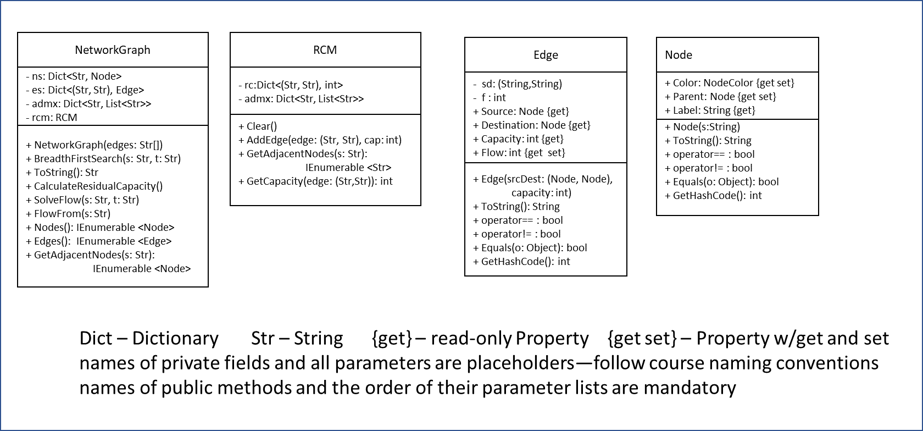

# Maximum Network Flow

Many problems can be modeled as the flow of some "thing" along defined pathways; the flow of items through a network.  Whether it is internet traffic (the flow of packets between routers) or the classic natural gas pipeline distribution problem, a special type of graph, a flow network, can be used to model certain network characteristics.  Determining the maximum flow the network can support is one of these characteristics.

A flow network is a graph that is a collection of a set of nodes (Nodes) and a set of directed (one way) edges (Edges) which follow certain rules.  All flow begins in a designated source-node (_s_) end terminates in a designated sink-node (_t_). 

* Nodes
    * There will be at least 2 Nodes
    * One node will be the source ("s"), or origination point of every flow
        * "s" may only have outgoing edges
    * One node will be the sink ("t"), or ultimate destination of every flow
        * "t" may only have incoming edges
    * All other nodes (n) lie on a path s -> n -> t
    * Nodes have two properties, Color and Parent, which facilitate path finding

* Edges 
    * Edges have a source node ("u") and a destination node ("v") often denoted "(u,v)"
    * Edges have a non-negative property, capacity, representing the maximum flow from u to v
        * if an Edge (u,v) does not exits in the graph its capacity is zero
    * There can be at most one edge between any two Nodes
        * if Edge (u,v) exists then the Edge (v,u) is not allowed
    * Edges have a Flow property representing the flow thru the edge
        * 0 <= Flow <= capacity 

In this homework we will build a program that analyzes flow networks to determine their maximum flow. This homework derives from the Ford-Fulkerson algorithm as described in Thomas H Cormen, et al "Introduction to Algorithms", 3d ed.

Note:  this description may refer to a Node as a String and an Edge as a (String, String)-tuple.  These represent the Node-Label (unique identifier) and the (sourceNode-Label, destinationNode-Label).

The maximum flow is the greatest rate at which we can push items from the source to the sink without violating the edges' capacity constraints.

## Finding the Maximum Flow

We will represent our flow network as graph with a set of Nodes(N) and Edges(E), G = (N, E).

The basic methodology  is to
1.  Initialize all the Edges' Flow to 0
1.  Calculate a Residual Capacity Matrix (RCM)
1.  While a breadth first search, using the RCM's residual capacities as edges, finds a path from s ~> t
    1. Find the minimum residual capacity of the RCM "edges" in the path, this represents an incremental flow which can be added to the network
    1. Update the graph's Edges' flow properties by adding the incremental flow along the path
    1. Re-calculate the Residual Capacity Matrix
1. If no path s~>t exists using the RCM, the flows in the graph (G) represent a maximal flow from s to t

There are two obvious subtasks in this procedure, calculating the Residual Capacity Matrix from the current state of the graph and conducting a Breadth First Search using the RCM to find a path from source to sink.

### Calculating a Residual Capacity Matrix

Because most of the edges in the RCM will have 0 capacity, we will use a Dictionary<(String, String), int> to represent it. The String-tuple represents an Edge (u,v) and the int is the calculated residual capacity for the edge.  Edges not found in the RCM-dictionary do not exists and therefor have 0 capacity.  To calculate a RCM

* For each edge (u,v) in the graph (G)
    * calculate the residual capacity, rc = (u,v).Capacity - (u,v).Flow
    * Add/update the edge (u,v) in the RCM with the new rc
    * Add/update the edge (v,u) in the RCM with (u,v).Flow
        * This backwards "edge" enables the algorithm to back-out previously assigned flow as it seeks a solution

### Breadth First Search

A Breadth First Search (BFS) explores a graph in a series of steps.  BFS starts at a node s, then systematically explores the edges of the graph to find every node "reachable" from s.  It first discovers all the nodes reachable by following one step (edge) from s.  Then it discovers every node 2 steps from s, then all nodes 3 steps from s, etc.  BFS finds a path with the fewest number of edges. You have seen modified BFS in our traveling Salesman problems. The algorithm we will follow is below.

* For each Node in N
    * set Color to White and Parent to null
* Make a Queue (Q)
* Set the starting node, s, Color to gray
* Enqueue(s)
* While Q is not empty
    * u = Dequeue
    * For each node v adjacent to u in the RCM (there exists a positive residual capacity for (u,v) in the RCM )
        * if v.Color is White
            * change v's Color to Grey, v's Parent to u
            * Enqueue(v)
    * Change u's Color to Black

At the end all reachable nodes are colored Black. If a path s-to-t exists, a backwards path from t -> s is contained in the Parent properties of the nodes.  

#### Getting the Path

|node|s|a|b|c|t|
|---|-|-|-|-|-|
|Parent|null|s|a|a|c|

If we traverse the nodes, starting at t, by following the Parent links we will either reach s or null.  If we reach s, then the path s-to-t are the nodes in the reverse order they are encountered in the traversal.

In the above example : t leads to c,  c leads to a and a leads to s.  The order of the traversal is {t,c,a,s} so the path is {s,a,c,t}.

However, it may be the case that t is unreachable, that is no path exists s->t.  If t is unreachable, t's Color will be white and a traversal starting at t will encounter a null-Parent before encountering s.  see the example below.

|node|s|a|b|c|t|
|---|-|-|-|-|-|
|Parent|null|s|a|null|null|

## Program Specifics

### Graph Representation

At its heart, a graph is a set of nodes and edges and a Flow Network graph is no exception.  We'll first cover the nodes, the edges and a representation for a residual capacity matrix.  Then we will present the required attributes of the graph.

##### Graph data files
We will be loading graphs from files.  As in your labs, these files contain lists of edges, one per line.  The format of a line is "source node, destination node, edge capacity".  A few graph files can be found in the starter solutions's Data folder.  All graph files are "valid" flow networks.

#### NodeColor

You should recall that a Breadth First Search involves "coloring" the nodes.  The needed "colors" are provided by an Enum, NodeColor.

#### Node

Each node in the graph must be represented by a Node-object. Nodes contain 3 public properties:
1.  Color -- a set-abel, get-able NodeColor which should initially be set to White.  Color represents the status of this node after the latest BFS.
1.  Parent -- a set-abel, get-able Node which should initially be set to null.  Parent is the parent-node of this node discoverd by the latest BFS.
1.  Label -- a read-only non-nullable String representing the "name" of the node.   Each Label must be unique. Labels act as a unique-identifier for Nodes in the graph.

Node-objects have 6 public methods.
* A constructor taking a String parameter for the Label; throw an ArgumentNull exception if the argument provided is null.
* A ToString returning the Label.
* Four methods dealing with Equality. Two Nodes are equal if and only if their Labels are equal.
    *  An operator for '=='
    *  An operator for '!='
    *  An override for  Equals( object? o)
    *  An override for GetHashCode().  This method should return the hashcode of the Label.

You may add any private methods you find helpful.

#### Edge

Each edge in the graph must be represented by an edge-Object.

Edge objects have two private fields:
1. A (Node, Node)-Tuple representing the source, destination Nodes of the edge. 
1. An int representing the current flow on an edge.  This flow will be adjusted during the process of finding maximum flow. It should initially be set to 0.

Edge objects have 4 public Properties:
1. Source - a read only Node that returns the source node of the private tuple.
1. Destination - a read only Node that returns the destination node of the private tuple.
1. Capacity - a read only int representing the maximum flow permitted on the edge.
1. Flow - An int which returns the value of the private int. On setting it sets the private int, throwing an Argument exception if a negative flow or flow above Capacity is provided.

Edge-objects have 6 public methods.
* A constructor taking a (Node, Node) parameter for the source-destination and an int for Capacity.  It should throw an ArgumentNull exception if either node is null or an Argument exception if the capacity is negative.
* A ToString returning a string similar to " source.Label -> destination.Label:  Flow / Capacity ".
* Four methods dealing with Equality. Two Edges are equal if and only if their private (Node, Node)-tuples are equal.
    *  An operator for '=='
    *  An operator for '!='
    *  An override for  Equals( object? o)
    *  An override for GetHashCode().  This method should return the hashcode of the private (Node,Node)-tuple.

You may add any private methods you find helpful.

### RCM (residual capacity matrix)

The RVM-object will have 2 private fields and 4 public methods.  The private fields include
* a Dictionary &lt; (String,String), int &gt; where the key represents the (source, destination) Nodes and the value is the residual capacity along that "edge".
* a Dictionary &lt; String, list &lt; String &gt;&gt; where the key is the source-node and the list contains the noses adjacent to the source.

The methods are
* Clear() - which clears the private dictionaries
* AddEdge((String, String) edge, int capacity) - where edge is the (source, destination) and capacity is the residual capacity.  This method will update both private dictionaries with the provided data.  It should throw an exception if either String is null or if the capacity is not positive.
* GetAdjacentNodes(String source)  - which yields the nodes (technically the nodes' labels) reachable from the provided source with a single edge transition
* GetCapacity((String, String) srcDest) - which returns the residual capacity of the edge (source, destination).  Edges not in the residual capacity dictionary have 0 residual capacity.

You may add any private methods you find helpful.

### NetworkGraph

A Flow Network graph consists of 4 private collections or objects:
1. A Dictionary<String, Node> containing all the nodes in the graph.  Nodes are accessed by their Label.
1. A Dictionary<(String, String), Edge> containing all the edges in the graph.  Edges are accessed by a (Source.Label, Destination.Label) tuple.
1. A Dictionary<String, List&lt;Node>> containing lists of the nodes connected by an edge to the initial node; an adjacency matrix .  The list is accessed by the source node's Label.
1. A RCM-object used to find incremental flows.

A Flow Network graph consists of 8 public methods:
* A constructor taking an array of "source-label, destination-label, capacity" _edge_ strings.  It will process each string, adding the edge and nodes to the appropriate private dictionaries. Note: edges and nodes may only be added during instantiation.
* BreadthFirstSearch(String start)-- which takes a string representing the starting node.  It must follow the BFS algorithm given above.  This method determines and assigns graph nodes' Parent and Color properties with the values calculated by the search.  This method is 'public' to facilitate testing.
* SolveFlow(String start, String finish) - which takes strings representing the source and sink nodes.  It must follow the "Finding the Maximum Flow" algorithm above. This method determines and assigns the Flow property value for all th graph's edges. 
* Three IEnumerable<> methods
    * Nodes() - yielding the Nodes in the nodes dictionary
    * Edges() - yielding the Edges in the edges dictionary
    * GetConnections(String source) - yielding the Nodes in the adjacency matrix for the provided source-key
* ToString() - an override of the generic implementation. Returns a "\r\n" separated list of the graph's edges.  
* FlowFrom(string src) - returns the sum of the flows from all src's outgoing edges

#### Private Methods

The class must contain least 4 private methods of your choosing.  No method, public or private may be more than 30 lines (Signature to closing brace, auto format applied).

### Provided Tests

The tests provided in the Test-project test some of the functionality of the Graph-project's classes.

## UserInterface

The User Interface is described below. Building it is a student task.  It should look similar to the image below.

### Controls

* "Load" button -- used to select a file from whish to load a graph, see below
* "Solve" button -- takes the node selected in the ListBoxes and finds the max flow from source to destination
* "Graph Display" TextBox -- used to display the edges of the graph.  It should be read-only, multi-line and have vertical and horizontal scroll bars.
* "Source" ListBox -- used to select the source node. Ensure SelectionMode is One. You will use the SelectedItem and Items properties see https://learn.microsoft.com/en-us/dotnet/api/system.windows.forms.listbox?view=windowsdesktop-7.0&viewFallbackFrom=net-6.0
* "Destination" ListBox -- used to select  the sink node. Ensure SelectionMode is One. You will use the SelectedItem and Items properties see https://learn.microsoft.com/en-us/dotnet/api/system.windows.forms.listbox?view=windowsdesktop-7.0&viewFallbackFrom=net-6.0
* "FlowResults" TextBox -- used to display the max-flow from source-to-sink once it is calculated, see below.  It should be read only, multi-line and have vertical and horizontal scroll bars
* Two labels, one for each ListBox
* An OpenFileDialog

### Private Field

* A NetworkGraph -- containing the graph for which  the maximum flow will be found.

### Private Methods

You may have as many private methods as you deem necessary.  No method, public or private may be more than 30 lines (Signature to closing brace).

### Program Behavior

* At start-up the  List and Text Boxes should be empty
* Clicking "Load Button" should
    * Prompt a user to select a graph file (the OpenFileDialog)
    * Read the file and use its data to instantiate the private NetworkGraph
    * Populate both ListBoxes with their own List of nodes (node labels) 
    * Populate the "Graph Display" TextBox with a string representation of the graph.  One edge per line showing "source -> destination: Flow / Capacity".
* Clicking "Solve Button" should
    * Do nothing if a graph hasn't been loaded
    * Open a MessageBox prompting user to select Source and Destination in the list boxes if either's SelectedItem is null. Then exit the method.
    * Use the selections in the ListBoxes to call SolveFlow(); update the "Graph Display" TextBox with a string representation of the graph.
    * Use the selections in the ListBoxes to call FlowFrom() and update the "Flow Results" TextBox.  The Display should be similar to "Net Flow from _source_ to _destination_ is _21_".

## Other Considerations

#### Submitting Your Solution
Be sure to commit and push all your changes to your GitHub repository. Submit the entire URL of the commit that you want graded.

Note: UNLIKE lab, GitHub will not re-run the unit tests.  The green "check" you see refers to GitHub logging a push time.  It has no connection to the functionality of your project.  Automatically generated emails from GitHub or GitHub-Classroom referencing "passing" the test refer to time-logging not your project's functionality.

